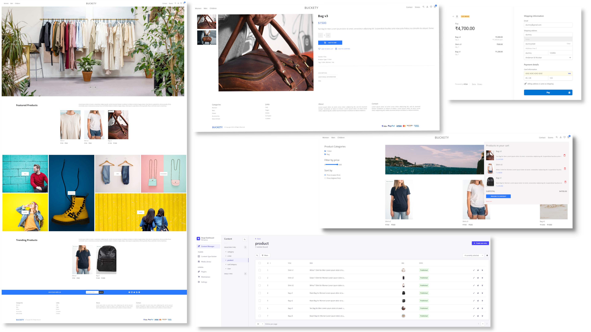

# React-Ecommerce-v1

Minimal e-commerce web app for fashion shopping.

### Technologies used

**FrontEnd**

- ReactJS Lib
- Redux for state management
- SCSS for styling

**BackEnd**

- NodeJS
- Strapi Headless CMS with MySQL for content management
- Stripe payment API

### Design

## FlowGif

For Development

- Clone this repo `git clone https://github.com/pvishnuprasaath/react-ecommerce-v1.git` (client is the required one)
- Create `.env` for both client and api. Use the `.env.example` as template
- For Client

  - Just do `npm install` to get all the dependencies
  - Create `.env` inside .\client based on the `.env.example` template
  - Complete the below server setup and finally run `npm start`

- For Server

  - Cant directly reuse the cloned api folder from repo. So rename it to api_org
  - Create a new .\api folder and setup strapi with mysql
  - Install MySQL workbench and create a schema named 'store'
  - Setup strapi with `npx create-strapi-app@latest .`
  - Select custom configuration and provide mysql user and pass
  - `npm run develop` will spin up the server
  - Login to strapi dashboard and create schemas based on /api/src/api/{category,order,product,subcategory}
  - Install stripe package with `npm install stripe`
  - Create Stripe account and copy the secret key to env
  - Create `.env` inside .\client based on the `.env.example` template
